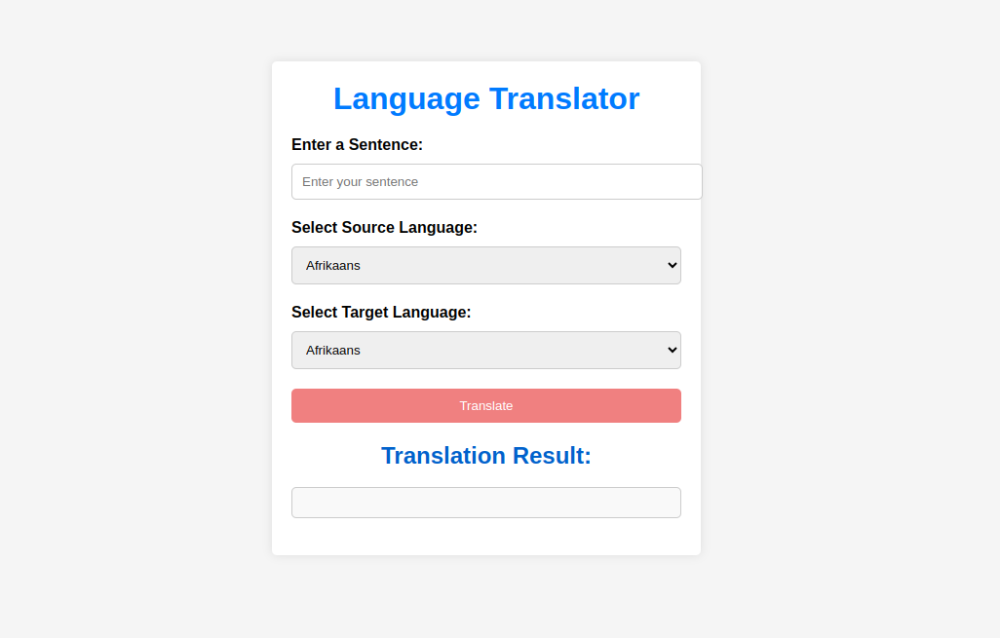

# Language Translator Web Application



## Introduction

The Language Translator web application is a Python-based tool that allows you to translate sentences from one language to another. It uses the Google Translate API for translation and provides a user-friendly web interface.

## Prerequisites

Before running the application, ensure you have the following prerequisites installed on your system:

- Python 3
- Virtual environment (recommended)


## Supported Languages

The Language Translator supports translation between a wide range of languages. Here are the list of supported languages:

- **English**
- **Hindi**
- **French**
- **German**
- **Italian**
- **Zulu**

## Getting Started

To set up and run the Language Translator web application, follow these steps:

1. Clone this repository to your local machine or download the ZIP file:

    ```shell
    git clone https://github.com/its-sushant/LanguageTranslator.git
    ```

2. Navigate to the `LanguageTranslator` directory:

    ```shell
    cd LanguageTranslator
    ```

3. Create a virtual environment:

    ```shell
    python3 -m venv venv
    ```

4. Activate the virtual environment:

    ```shell
    source venv/bin/activate
    ```

5. Install the required dependencies:

    ```shell
    pip install -r requirements.txt
    ```

6. Start the application:

    ```shell
    python3 app.py
    ```

7. Open a web browser and go to [http://127.0.0.1:5000/](http://127.0.0.1:5000/).

## Usage

1. Enter the sentence you want to translate in the "Enter a Sentence" input field.
2. Select the source language from the "Select Source Language" dropdown.
3. Select the target language from the "Select Target Language" dropdown.
4. Click the "Translate" button.
5. View the translation result in the "Translation Result" section.

## Features

- User-friendly web interface.
- Supports translation between multiple languages.
- Utilizes the Google Translate API for accurate translations.

## Author

- [Sushant Kumar](https://github.com/its-sushant)

